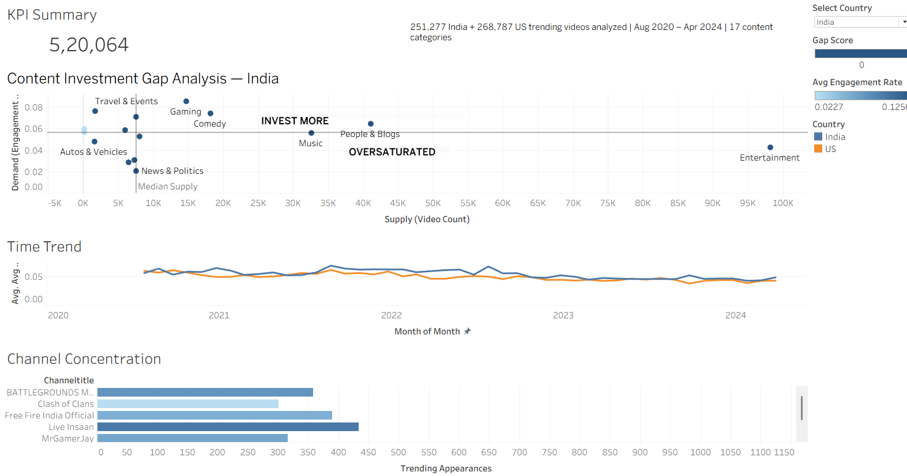
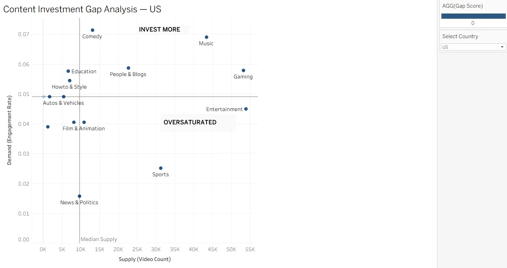
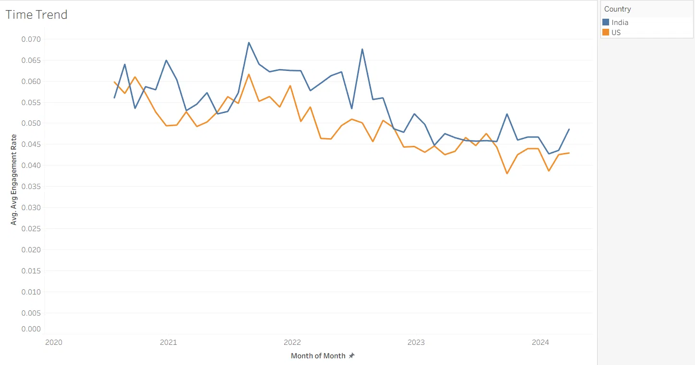
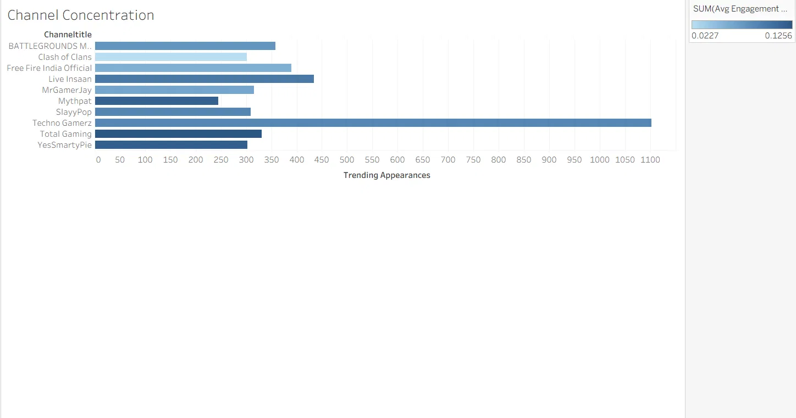

# Content Investment Gap Analysis — India vs. US YouTube Markets

> **SQL + Tableau analysis identifying underserved content categories across two markets,
> with a data-driven investment recommendation.**

---

## Objective

Analyzed 520,000+ YouTube trending videos across India and the US (Aug 2020–Apr 2024)
to identify content categories where audience demand consistently outpaces existing
content supply — and where content teams are currently over-invested relative to
audience interest.

The core question: **Where should a media content team invest, and where are they wasting budget?**

---

## Tools Used

| Tool | Purpose |
|---|---|
| PostgreSQL 18 | Database setup, data loading, all SQL queries |
| SQL | Aggregations, CTEs, UNION ALL, joins, window functions |
| Python (psycopg2, pandas) | Data cleaning and bulk ingestion (NUL-byte handling) |
| Tableau Public | Interactive dashboard with parameter-driven country toggle |

---

## Dataset

- **Source:** [YouTube Trending Video Dataset](https://www.kaggle.com/datasets/rsrishav/youtube-trending-video-dataset) by rsrishav (Kaggle)
- **India:** 251,277 rows | Aug 2020 – Apr 2024
- **US:** 268,787 rows | Aug 2020 – Apr 2024
- **Total:** 520,064 trending video records across 17 content categories

---

## Process

1. Loaded raw India and US YouTube trending CSVs into PostgreSQL using a custom
   Python ingestion script (`scripts/clean_and_load.py`) that handles encoding issues,
   NUL bytes, and malformed rows that crash standard CSV importers
2. Built a `category_mapping` lookup table mapping numeric category IDs to readable names
3. Calculated **Demand** (average engagement rate = likes + comments / views) and
   **Supply** (trending video count) per category per country
4. Derived a custom **Gap Score = Supply Rank − Demand Rank**, excluding categories
   with fewer than 1,000 trending videos to avoid small-sample distortion
5. Exported aggregated CSVs and built an interactive Tableau dashboard with:
   - A parameter-driven country toggle (India ↔ US) updating all charts live
   - A Gap Matrix scatter plot showing demand vs. supply with quadrant annotations
   - A 3.5-year monthly trend line validating findings are structural, not a spike
   - A channel-level concentration chart (Top 10 Gaming channels, India)
6. Delivered a written business recommendation ([recommendation.md](recommendation.md))

---

## Key Insights

- **Gaming is India's most underserved high-demand category** — engagement rate ~0.085
  (highest of any reliable category) against comparatively moderate supply of 14,735 videos
- **The same category is the most oversaturated in the US** — similar engagement (~0.058)
  spread across nearly 4× the content volume (53,242 videos), diluting return per piece
- **The divergence is structural, not a snapshot** — India's Gaming engagement sits above
  the US figure in nearly every month across the full 3.5-year window
- **Competitive structure is mixed, not closed** — a clear top tier exists (Techno Gamerz,
  ~1,050 trending appearances), but the next 25+ channels form a fragmented mid-tier,
  indicating room for differentiated new entrants

Full findings and recommendation → [recommendation.md](recommendation.md)

---

## Live Dashboard

**[View interactive Tableau Public dashboard →](https://public.tableau.com/app/profile/dhivya.shri.r6061/viz/ContentInvestmentGapAnalysis-IndiavsUSYouTubeMarkets/ContentInvestmentDashboard)**

Use the **Select Country** dropdown to toggle between India and US views.

---

## Dashboard Screenshots

### Full Dashboard — India View
KPI summary (520,064 videos analyzed), Gap Matrix showing Gaming in "INVEST MORE",
Time Trend, and Channel Concentration.



### Gap Matrix — US View
The country toggle flips the picture — Gaming moves to "Oversaturated" in the US,
Comedy and Music emerge as the stronger opportunities.



### Time Trend — Gaming Engagement (India vs. US, 2020–2024)
India's Gaming engagement (blue) consistently sits above the US (orange)
across the full 3.5-year window.



### Channel Concentration — Top 10 Gaming Channels (India)
Techno Gamerz dominates with ~1,050 trending appearances; the remaining
9 channels form a fragmented, enterable mid-tier.



---

## Repository Structure

```
youtube-content-gap-analysis/
├── README.md                         # This file
├── recommendation.md                 # Written business recommendation
├── sql/
│   ├── gap_analysis_queries.sql      # All analytical SQL queries (cleaned + commented)
│   └── raw_session_history.sql       # Original raw query session (backup)
├── scripts/
│   └── clean_and_load.py             # Python ingestion script for CSV → PostgreSQL
├── data/
│   ├── india_category_summary.csv    # Per-category aggregates, India
│   ├── us_category_summary.csv       # Per-category aggregates, US
│   ├── monthly_trend_combined.csv    # Monthly engagement by country (Gaming filter)
│   └── gaming_channel_concentration_india.csv  # Top 30 Gaming channels, India
└── dashboard/
    └── screenshots/                  # Dashboard screenshots (see above)
```

---

## SQL Highlights

Key techniques used — see [`sql/gap_analysis_queries.sql`](sql/gap_analysis_queries.sql) for full annotated queries:

- **JOIN** between raw trending data and category_mapping lookup table
- **Aggregations** (COUNT, AVG, SUM, ROUND) for demand and supply metrics
- **UNION ALL** combining India and US tables into a single cross-market monthly trend
- **Inline CAST** (`trending_date::timestamp`) to handle TEXT-stored dates in the US table
- **LIMIT + ORDER BY** for channel concentration ranking

---

## Related Projects

- [Bank Customer Churn Analysis](https://github.com/dhivyashrirethinakumar-06/bank-customer-churn-analysis) — SQL + Power BI

---

## About

Self-directed analytics project | PostgreSQL, SQL, Python, Tableau
